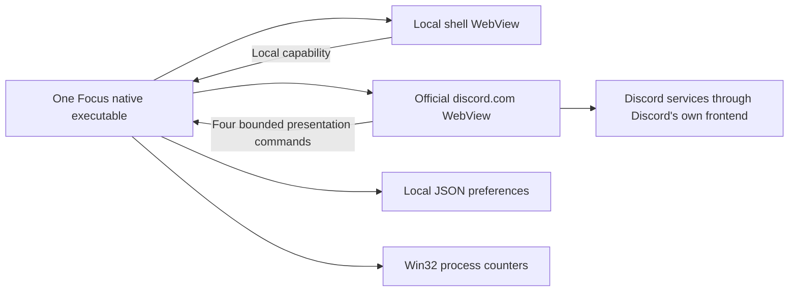

# Focus V1 architecture

> Archive du prototype WebView2 0.1. L'architecture actuelle est décrite dans [le guide Desktop](../desktop/README.md).

The brief uses both Focus and MonoCord. This project consistently uses **Focus**.

## Ownership

| Focus controls | WebView2 controls | Discord controls |
| --- | --- | --- |
| Native window, tray, single instance | Browser, renderer, GPU, utility processes | Normal login and session |
| Local shell and settings | Chromium memory and scheduling | Account, guild, channel, DM and message state |
| Local hidden-item preferences | Browser profile and credential protection | Networking and React lifecycle |
| Conservative DOM/CSS presentation adapter | WebRTC browser implementation | Voice UI and signaling |
| Attachment video pause policies | Microphone/camera/screen permissions | Message/member/channel virtualization |
| Process counters and opt-in frame sampler | Internal decoded-media and disk caches | Search, moderation, reactions, stickers and friends |

Two webviews share one WebView2 user-data directory and matching browser arguments. This permits the runtime to share its environment; it does not guarantee a fixed process count. Focus has one main executable, no launcher daemon, helper executable, updater service, or tray process. WebView2 necessarily creates multiple processes. No sandbox disabling, single-process flag, GPU disabling, or private Discord API integration is used.

## Native modules

`settings.rs` validates a versioned, bounded JSON model, writes a same-directory temporary file, flushes it, and renames it over the old settings. Invalid files are preserved and startup fails rather than silently overwriting preferences. The store is serialized by a mutex. Hidden servers and friends/conversations have independent operations so a stale appearance form cannot erase hidden choices.

`resource_manager.rs` makes focus/minimize transitions explicit. Every policy preserves realtime networking and media. Focus never invokes WebView2 suspension, destroys the Discord webview on navigation, or infers voice inactivity from hidden UI. Hiding the Discord child view to show settings keeps its session alive.

`performance.rs` enumerates only the main process and descendant `msedgewebview2.exe` processes for aggregation. Windows counters supply working set, private commit, and CPU time. Shared working-set pages may be counted multiple times. CPU is normalized by logical processor count, and the first sample is unknown. A 30-sample bounded mean of unfocused/minimized CPU is explicitly an estimate, not idle detection. Process creation times prevent PID reuse from creating false CPU spikes.

`logging.rs` accepts only Focus-targeted messages, uses WARN/ERROR in release and INFO in debug, and bounds logs to one 256 KiB file plus one rotated file. No URLs, page titles, messages, network payloads, credentials or cookies are logged.

## Presentation adapter

The origin- and top-frame-guarded initialization script uses public DOM selectors only. It never reads React fibers, webpack modules, local/session storage, cookies, auth traffic, or Discord network APIs. Most updates come from mutation and intersection observers; changes are coalesced, with a longer delay in background mode. There is no permanent full-page polling loop.

Positive selectors hide commercial navigation without disabling boosted-server capabilities. Monochrome is enforced with CSS variables and a static grayscale filter. The filter's GPU cost is not assumed to be free. Unknown Discord layouts are left alone. The original Discord context menu is extended with a local Hide action where a stable ID exists; Shift + right-click opens an independent Focus menu. Restore never calls Discord.

Hidden items remain in Discord's internal state. `display:none` suppresses presentation, not React allocations, subscriptions, networking, decoded avatars, or off-screen unread work. Unread notices are best effort based on observable hidden DM indicators; Focus cannot guarantee a hidden-message notification if Discord does not mount that navigation row. Selecting Open once uses the existing page link without permanently removing the preference. Unsupported friend-row identifiers cannot be hidden safely.

GIF avatars/emoji with recognized Discord CDN `.gif` URLs use PNG alternatives when animation is disabled. Other formats, Lottie stickers, generic GIF attachments and picker internals are not controlled. Only videos under message DOM nodes are paused. `srcObject` streams and all audio are excluded. User interactions with a message allow its attachment video to play. Paused videos never resume automatically.

## Security boundary

Tauri's app manifest explicitly lists every command, changing custom commands from default access to permission-controlled access. Capabilities name **webviews**, never the shared native window. The local shell has bounded configuration/window/diagnostic operations. The Discord view, at exactly `https://discord.com/*`, has only:

* `bridge_ready`: a fixed enum of presentation statuses.
* `bridge_hide`: a validated snowflake ID, item type, and bounded display label.
* `bridge_unread`: at most 500 IDs, filtered against locally hidden conversations.
* `bridge_metrics`: validated numeric measurements only when diagnostics are enabled.

Commands additionally check the invoking webview label; remote commands also check the current exact origin. Discord cannot read settings, invoke arbitrary JavaScript, use filesystem/shell APIs, create windows, subscribe to native events, or export files. Settings/policies are pushed from native code with JSON serialization, not string interpolation of IDs. Remote reports are untrusted observations, not authority for process measurements.

External top-level HTTP(S) navigation opens in the default browser. Other schemes are refused. CAPTCHA subframes are untouched. Release webviews disable developer tools; there is no shipped remote-debugging switch. Profile storage uses WebView2's normal per-user protections. Focus does not copy or inspect its authentication data. This is OS account protection, not an encrypted vault implemented by Focus.

## Renderer experiments

`AdaptiveViewportEngine` uses a Fenwick tree for measured variable heights and logarithmic offset lookups. Velocity adjusts overscan from 8 to 12 to 20 rows. The target is at most 80 mounted rows unless the visible viewport itself requires more; correctness takes precedence. Settling shrinks overscan via a one-shot timer. HOT is visible, WARM is overscan, and COLD has no row DOM.

Only the explicit 30,000-row synthetic lab uses this engine. Closing the lab destroys its heavy DOM and retains a tiny scroll-state entry in a weighted bounded LRU. No production Discord data is supplied to this renderer. Recycling has not been claimed faster or added without measurement.

## Measurements

The opt-in monitor samples every two seconds. Its Discord `requestAnimationFrame` loop exists only while monitoring, visible, and focused. Frame intervals measure callback cadence, not main-thread work, GPU execution, compositor presentation, or scrolling throughput. Dropped frames are an estimate against a 60 Hz interval. Long tasks use the browser observer where available.

Images loaded are images with completed loads and nonzero natural width, **not proven decoded allocations**. Message DOM elements are observable DOM counts, **not messages loaded in Discord memory**. GPU usage, decoded GIFs, internal cache sizes, and total messages loaded are shown as unavailable. Benchmark captures are bounded to 600 samples and exported locally.

References: [Tauri capabilities](https://v2.tauri.app/security/capabilities/), [WebView2 API overview](https://learn.microsoft.com/en-us/microsoft-edge/webview2/concepts/overview-features-apis), [WebView2 security](https://learn.microsoft.com/en-us/microsoft-edge/webview2/concepts/security).
